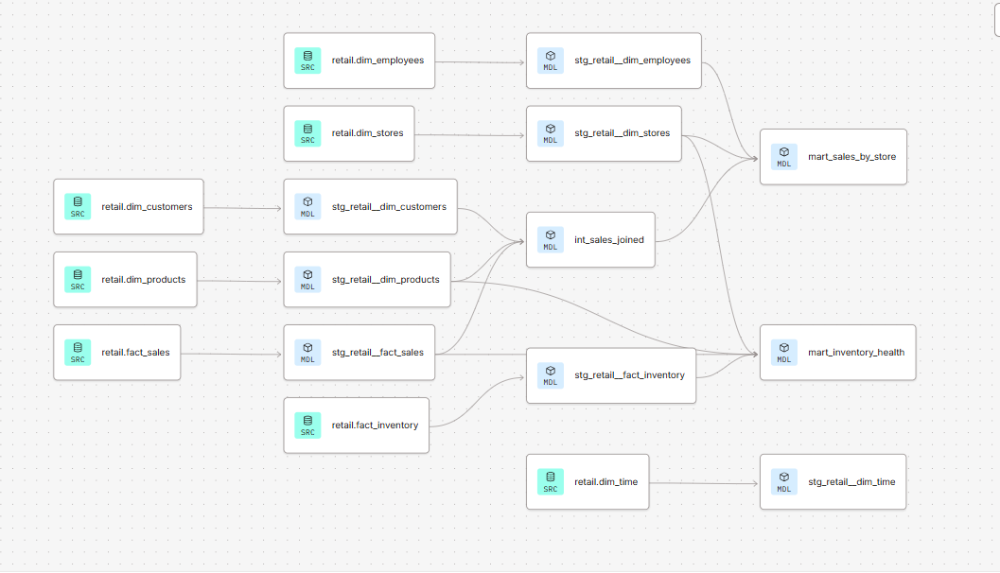

# Retail Sales Analytics — dbt + Snowflake

An end-to-end data modeling project answering: **which product categories,
regions, stores, and customer segments drive retail revenue — and which
products/stores are at risk of overstock or stockout?**

## Business questions answered

| Mart | Question |
|---|---|
| `mart_sales_by_category_region` | Which product categories sell best, and in which regions? |
| `mart_store_performance` | Which stores generate the most revenue per employee? |
| `mart_customer_segmentation` | Which customers are high-value and loyal — and which are high-value but at risk of churning? |
| `mart_monthly_revenue_trend` | Is revenue trending up, down, or flat month over month? |
| `mart_inventory_health` | Which products/stores are overstocked or at risk of stockout? |

## Architecture

```
Snowflake (raw layer)
   dim_customers, dim_products, dim_stores, dim_time, dim_employees
   fact_sales, fact_inventory
        │
        ▼
dbt staging models (models/staging/retail/)
   one-to-one cleaning/renaming of each raw source
        │
        ▼
dbt intermediate model (int_sales_joined)
   joins fact_sales + dim_products + dim_customers at the sale grain
        │
        ▼
dbt marts (models/marts/)
   mart_sales_by_category_region
   mart_store_performance
   mart_customer_segmentation
   mart_monthly_revenue_trend
   mart_inventory_health  (built from fact_sales + fact_inventory directly)
```



See [full data lineage](docs/lineage.md) for more detail.

Built and run entirely in **dbt Cloud**, warehouse: **Snowflake**.

## Data

The dataset is synthetically generated (Python) rather than sourced from a
public dataset, in order to guarantee full control over the star-schema
structure (5 dimensions + 2 facts) needed for this project. See
`data_generation/generate_sales_data_v2.py`.

## Testing

Basic dbt schema tests (`not_null`, `unique`, `accepted_values`) were
planned for `models/marts/schema.yml` but not included in this version due
to a YAML configuration issue encountered late in development. A future
iteration would add these back.

## Known limitations

- **Synthetic data**: revenue patterns are randomly generated and don't
  reflect a real business — the pipeline and modeling approach are the
  focus of this project, not the findings themselves.
- **No BI layer**: this version ships as a dbt-only project. A Power BI
  dashboard connecting to these marts was scoped but not included here.
- **No forecasting model**: a linear-regression revenue forecast was
  prototyped separately but is not part of this repository.
- **No dbt tests**: see Testing section above.

## Stack

dbt Cloud · Snowflake · Python (data generation)
